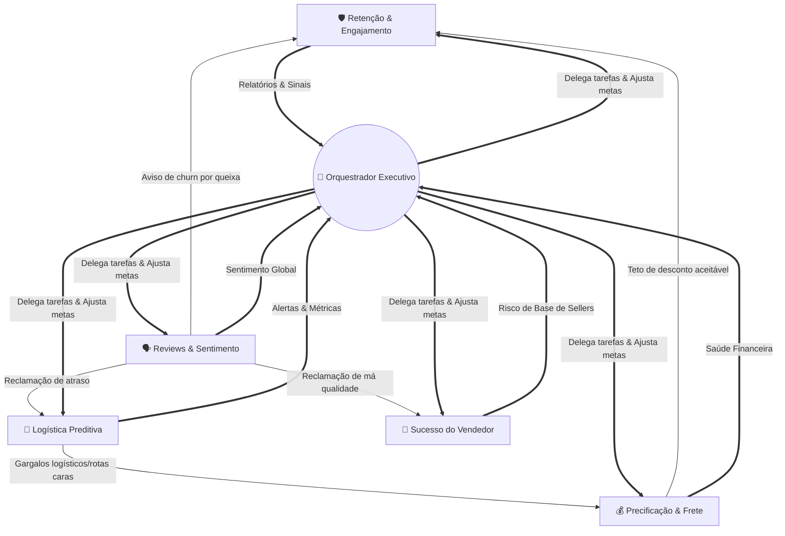

# 🗺️ Mapa Estratégico de Agentes de IA: E-commerce Olist

Este documento detalha o ecossistema multi-agente projetado para otimizar a operação, logística e satisfação dos clientes e vendedores (sellers) na Olist. A arquitetura contempla 5 agentes especialistas e 1 agente orquestrador.

---

## 1. 🛡️ Agente de Retenção e Engajamento (Anti-Churn)
*Transformando clientes em risco em defensores da marca.*

- **Problema que resolve:** A taxa de recompra atual é de apenas 3%, e existem 38.655 clientes identificados no cluster "Em Risco" (baseado em análise RFM).
- **Inputs:** Dados de navegação, histórico de compras, segmentação RFM, recência de acesso, tickets de atendimento abertos.
- **Outputs:** Campanhas de e-mail personalizadas, alertas para equipe de CS (Customer Success), vouchers de desconto dinâmicos.
- **Ferramentas / Técnicas de IA:** Modelos preditivos de Machine Learning (XGBoost/Random Forest para propensão de churn), LLMs para geração de copy de e-mail personalizada.
- **Stakeholders:** Marketing, CRM, Atendimento ao Cliente.
- **KPIs de sucesso:** Taxa de recompra (Lift), redução do tamanho do cluster "Em Risco", ROI das campanhas de retenção.
- **Impacto esperado:** Elevar a taxa de recompra de 3% para 7% em 12 meses, recuperando aproximadamente 10% dos clientes em risco.
- **Interações:** Recebe dados do *Agente de Análise de Reviews* para não enviar ofertas a clientes frustrados. Envia insights de comportamento para o *Orquestrador*.

---

## 2. 🚚 Agente de Logística Preditiva
*Antecipando atrasos e otimizando a malha de entregas.*

- **Problema que resolve:** 8,11% dos pedidos sofrem atrasos, e o pacote passa 74% do tempo de entrega "em trânsito" entre o envio e a chegada.
- **Inputs:** CEPs de origem/destino, histórico de tempo de entrega, volumetria do pedido, dados meteorológicos e de tráfego, status do rastreio.
- **Outputs:** Rotas alternativas sugeridas, alertas preditivos de atraso, comunicação proativa para o cliente sobre status da entrega.
- **Ferramentas / Técnicas de IA:** Redes Neurais baseadas em Grafos (GNN) para malha logística, Modelos de Regressão de Séries Temporais, Geocodificação Inteligente.
- **Stakeholders:** Logística, Operações, Transportadoras parceiras.
- **KPIs de sucesso:** Redução do percentual de atrasos, diminuição do tempo médio em trânsito, redução de contatos no SAC sobre "Onde está meu pedido".
- **Impacto esperado:** Reduzir a taxa de atraso de 8,11% para menos de 4% e encurtar o tempo de trânsito em 15%.
- **Interações:** Interage ativamente com o *Agente de Precificação e Frete*, compartilhando gargalos em certas rotas para que o frete seja precificado adequadamente.

---

## 3. 🗣️ Agente de Análise de Reviews e Sentimento
*A voz do cliente como inteligência de negócio.*

- **Problema que resolve:** 11,5% dos pedidos recebem nota 1. As palavras-chave predominantes em avaliações negativas são "prazo" e "entregue".
- **Inputs:** Textos de reviews, pontuação (1 a 5 estrelas), data da avaliação, IDs de pedidos e produtos correspondentes.
- **Outputs:** Dashboards de sentimento em tempo real, classificação automática de queixas (Logística vs. Qualidade do Produto), tickets urgentes abertos automaticamente.
- **Ferramentas / Técnicas de IA:** Processamento de Linguagem Natural (NLP), LLMs (GPT-4/Claude) para análise de sentimento e extração de tópicos, Topic Modeling (LDA).
- **Stakeholders:** Experiência do Cliente (CX), Gestão de Produto, SAC.
- **KPIs de sucesso:** Tempo de resposta para avaliações nota 1, aumento do Net Promoter Score (NPS), precisão na classificação dos tickets.
- **Impacto esperado:** Reverter 30% das notas 1 em avaliações neutras/positivas pós-tratamento e reduzir o tempo de triagem manual a zero.
- **Interações:** Dispara alertas diretos para o *Agente de Sucesso do Vendedor* caso a reclamação seja atrelada à qualidade do produto do parceiro.

---

## 4. 🤝 Agente de Sucesso do Vendedor (Seller Success)
*Garantindo a qualidade da ponta vendedora do marketplace.*

- **Problema que resolve:** Existem 527 sellers identificados como problemáticos, que possuem uma nota média crítica de 2,22, prejudicando o ecossistema.
- **Inputs:** Avaliações de clientes por seller, taxa de cancelamento do vendedor, tempo de postagem do produto.
- **Outputs:** Planos de ação automatizados para sellers, alertas de risco de suspensão, recomendações de melhores práticas de embalagem/envio.
- **Ferramentas / Técnicas de IA:** Sistema de Recomendação baseado em regras e Reinforcement Learning para otimizar os planos de ação que melhor recuperam a nota do seller.
- **Stakeholders:** Área Comercial, Key Account Managers, Compliance do Marketplace.
- **KPIs de sucesso:** Redução no número de sellers problemáticos, aumento da nota média desses sellers, diminuição de cancelamentos por parte do vendedor.
- **Impacto esperado:** Recuperar 50% dos 527 sellers problemáticos em 6 meses (elevando a nota média para >4.0) e suspender rapidamente os irrecuperáveis.
- **Interações:** Consome dados do *Agente de Análise de Reviews* e envia métricas de risco para o *Orquestrador* avaliar a saúde do marketplace.

---

## 5. 💰 Agente de Precificação e Frete Inteligente
*Equilibrando competitividade e rentabilidade.*

- **Problema que resolve:** O custo de frete representa, em média, 21% do valor total da compra, sendo uma das principais causas de abandono de carrinho.
- **Inputs:** Dimensões e peso dos produtos, CEP de origem/destino, categorias dos produtos, margem do lojista, tabelas das transportadoras.
- **Outputs:** Preço de frete dinâmico otimizado, sugestão de subsídio parcial para produtos de alta margem, alertas de precificação de produto fora do mercado.
- **Ferramentas / Técnicas de IA:** Algoritmos de Precificação Dinâmica (Dynamic Pricing) usando Elasticidade de Preço, Modelos Preditivos de Conversão.
- **Stakeholders:** Financeiro, Comercial, Logística.
- **KPIs de sucesso:** Aumento na taxa de conversão no checkout, margem de lucro preservada, redução da representatividade do frete no ticket total.
- **Impacto esperado:** Aumento de 12% na conversão final de vendas através da redução percebida do peso do frete no valor total.
- **Interações:** Informa ao *Agente de Retenção* os melhores limites de vouchers para clientes em risco, evitando que descontos prejudiquem a margem.

---

## 6. 🧠 Agente Executivo de BI e Orquestrador
*O cérebro da operação: síntese e decisão autônoma.*

- **Problema que resolve:** A fragmentação de dados impede uma visão holística em tempo real e atrasa a tomada de decisão estratégica entre os departamentos.
- **Inputs:** Sinais e outputs de todos os 5 agentes especialistas, KPIs globais da empresa.
- **Outputs:** Relatórios executivos sumarizados diários, delegação autônoma de tarefas (ex: mandar o Agente de Logística re-rotear por conta de um insight do Agente de Reviews), alertas para a diretoria (C-Level).
- **Ferramentas / Técnicas de IA:** Arquitetura Multi-Agent (ex: LangChain / CrewAI / Google Antigravity), LLMs com RAG (Retrieval-Augmented Generation) acoplados ao Data Warehouse, Raciocínio de Planejamento (Plan-and-Solve).
- **Stakeholders:** C-Level (CEO, COO, CFO), Diretores, Gerentes Gerais.
- **KPIs de sucesso:** Redução no tempo de tomada de decisão, número de intervenções autônomas bem-sucedidas, precisão na previsão de faturamento semanal.
- **Impacto esperado:** Centralização de inteligência que economiza até 40 horas semanais em consolidação manual de relatórios gerenciais e relata crises antes delas escalarem.
- **Interações:** É o "HUB". Gerencia os conflitos (ex: Retenção quer dar 50% de desconto, mas Finanças/Frete acusa prejuízo – o Orquestrador encontra o meio-termo).

---

## 🔄 Topologia de Interação dos Agentes

---

## 🗺️ Roadmap de Implementação

### Fase 1: Inteligência Isolada (Meses 1-3)
*Foco na validação e ganhos rápidos.*
- Deploy do **Agente de Análise de Reviews**, processando a base histórica de textos para classificar as notas 1.
- Deploy do **Agente de Retenção**, rodando batch (lotes) diários em cima dos 38 mil clientes "Em Risco".
- Deploy do **Agente de Sucesso do Vendedor**, atuando passivamente enviando relatórios semanais aos 527 sellers problemáticos.

### Fase 2: Sinergia e Comunicação (Meses 4-6)
*Conexão entre os agentes criando reações em cadeia.*
- Deploy do **Agente de Logística Preditiva** integrado às APIs de rastreio.
- Deploy do **Agente de Precificação**.
- Estabelecimento da comunicação direta (pub/sub): Agente de Reviews começa a acionar Logística e Sellers instantaneamente no momento da avaliação negativa.

### Fase 3: Orquestração e Autonomia Executiva (Meses 7-9)
*Ativação do cérebro central.*
- Deploy do **Agente Executivo de BI e Orquestrador**.
- Agentes passam a enviar logs detalhados ao Orquestrador.
- O Orquestrador começa a gerar briefings diários de 1 página para o C-Level.
- Liberação gradual de autonomia (ex: o Orquestrador aprova verbas extras de voucher se a satisfação global cair abaixo de um limite).
