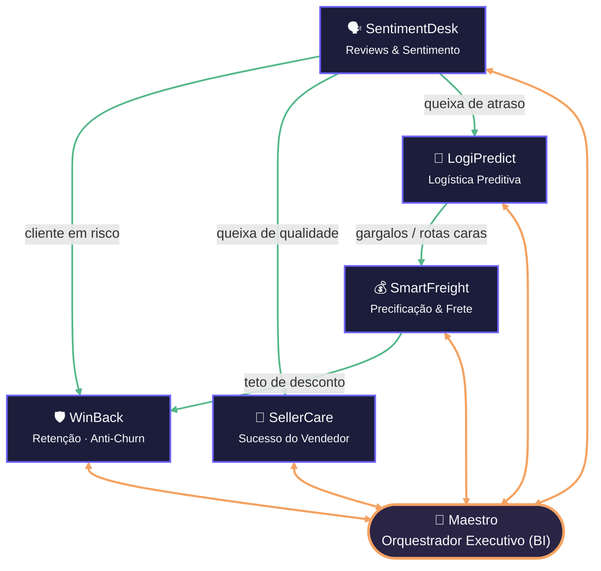

# 🗺️ Mapa de Agentes de IA — Marketplace Olist

> **Entregável 2 (Fase 1).** Ecossistema multi-agente proposto para a Olist: **5 agentes especialistas + 1 orquestrador**. Cada agente nasce de um achado real da análise de dados (2016–2018, 99.441 pedidos).
>
> Para cada agente apresentamos os 5 elementos pedidos pelo desafio — **Nome · Objetivo · Problema resolvido · Usuários envolvidos · Benefício esperado** — em formato executivo, com as interações e riscos principais. O detalhamento técnico (modelos, tools, prompts) está no documento **[PROMPTS_ESTRUTURADOS.md](PROMPTS_ESTRUTURADOS.md)**.

---

## 📇 Visão geral (nomenclatura canônica)

| # | Nome do agente | Codinome | Problema-âncora (dado) |
|---|----------------|----------|------------------------|
| 1 | Agente de Retenção (Anti-Churn) | **WinBack** | Recompra de apenas 3% |
| 2 | Agente de Logística Preditiva | **LogiPredict** | 8,11% de atrasos; 74% do tempo em trânsito |
| 3 | Agente de Reviews & Sentimento | **SentimentDesk** | 11,5% das avaliações são nota 1 |
| 4 | Agente de Sucesso do Vendedor | **SellerCare** | 527 sellers no cluster problemático (nota 2,22) |
| 5 | Agente de Precificação & Frete | **SmartFreight** | Frete = 21% do pedido (até 46% em móveis) |
| 6 | Agente Orquestrador Executivo (BI) | **Maestro** | Dados fragmentados atrasam a decisão |

> **Nota sobre atendimento ao cliente (SAC):** optamos por **não** criar um agente de SAC conversacional dedicado nesta fase. O contato direto com o cliente final está **distribuído** entre o **SentimentDesk** (que redige e dispara respostas a avaliações) e o **WinBack** (que conduz a comunicação de reativação). Um agente de atendimento transacional autônomo é candidato natural para a Fase 2.
>
> **Nota sobre cross-sell:** a criação de kits/bundles (cross-selling) foi incorporada como **capacidade do SmartFreight** (o agrupamento dilui o frete no peso/cubagem), evitando um agente redundante.

---

## 1. 🛡️ Agente de Retenção — WinBack
*Transformar clientes em risco em compradores recorrentes.*

- **Objetivo:** monitorar a base e reativar automaticamente clientes que entram no segmento "Em Risco", maximizando recompra e LTV.
- **Problema que resolve:** recompra de apenas **3%**; **38.655 clientes** no cluster "Em Risco" (RFM, inativos há +439 dias) sem nenhuma ação proativa hoje.
- **Usuários envolvidos:** Marketing, CRM, Customer Success.
- **Benefício esperado:** elevar a recompra de **3% → 7%** em 12 meses, recuperando ~10% dos clientes em risco.
- **Interações:** recebe do **SentimentDesk** o sinal de "cliente frustrado" (para não ofertar a quem está insatisfeito); consulta o **SmartFreight** o teto de desconto viável; reporta ao **Maestro**.
- **Riscos & guardrails:** risco de spam/over-communication e de descontos que corroem margem. Guardrail: limites de frequência e de voucher por regra; **aprovação humana** para campanhas acima de X% de desconto; consentimento de contato (**LGPD**).

## 2. 🚚 Agente de Logística Preditiva — LogiPredict
*Antecipar atrasos antes que o cliente reclame.*

- **Objetivo:** prever risco de atraso por pedido e comunicar o cliente de forma proativa, priorizando rotas críticas.
- **Problema que resolve:** **8,11%** de atrasos; **74%** do tempo de entrega está "em trânsito" (9,19 dias) e não no vendedor (3,28 dias). Estados do Nordeste chegam a 24% de atraso.
- **Usuários envolvidos:** Logística, Operações, Transportadoras parceiras.
- **Benefício esperado:** reduzir atrasos de **8,11% → <4%** e encurtar o tempo em trânsito em ~15%.
- **Interações:** envia gargalos de rota ao **SmartFreight**; recebe do **SentimentDesk** reclamações de "prazo"; reporta ao **Maestro**.
- **Riscos & guardrails:** falso alarme (avisar atraso que não ocorre) gera ansiedade. Guardrail: só notificar acima de um limiar de confiança; mensagens revisáveis; não expor dados sensíveis de rota.

## 3. 🗣️ Agente de Reviews & Sentimento — SentimentDesk
*A voz do cliente como inteligência operacional em tempo real.*

- **Objetivo:** ler avaliações, classificar sentimento/tema e disparar ações (resposta, ticket, alerta) imediatamente.
- **Problema que resolve:** **11,5%** de notas 1; palavras-chave dominantes "prazo/entregue"; tempo médio de resposta hoje de **3,15 dias**.
- **Usuários envolvidos:** Experiência do Cliente (CX), Gestão de Produto, SAC.
- **Benefício esperado:** reduzir o tempo de resposta a notas 1 de 3 dias para minutos; reverter ~30% das notas 1 em neutras/positivas.
- **Interações:** aciona **LogiPredict** (queixa de atraso), **SellerCare** (queixa de produto) e **WinBack** (cliente em risco de churn); reporta ao **Maestro**.
- **Riscos & guardrails:** classificação errada de sentimento e respostas inadequadas. Guardrail: **rascunho com aprovação humana** para casos sensíveis; bloqueio de conteúdo ofensivo; não tomar decisão punitiva só com base em 1 review.

## 4. 🤝 Agente de Sucesso do Vendedor — SellerCare
*Proteger a reputação do marketplace na ponta vendedora.*

- **Objetivo:** diagnosticar sellers de baixa performance, enviar coaching e escalar suspensão quando necessário.
- **Problema que resolve:** **527 sellers** no cluster "Problemático" (K-means: nota média **2,22**, entrega 14,4 dias); **342 sellers** com nota <3,0. Concentração alta (Gini **0,792**; 17,6% geram 80% da receita).
- **Usuários envolvidos:** Área Comercial, Key Account Managers, Compliance.
- **Benefício esperado:** recuperar ~50% dos 527 sellers problemáticos em 6 meses (nota >4,0) e suspender rapidamente os irrecuperáveis.
- **Interações:** consome alertas do **SentimentDesk**; envia risco da base ao **Maestro**.
- **Riscos & guardrails:** suspender injustamente um bom seller tem alto custo. Guardrail: suspensão **sempre com revisão humana**; critérios auditáveis e transparentes; direito de resposta do seller.

## 5. 💰 Agente de Precificação & Frete — SmartFreight
*Reduzir o peso do frete na conversão, preservando margem.*

- **Objetivo:** otimizar frete e precificação (incl. **kits/bundles**) para reduzir abandono de carrinho sem destruir margem.
- **Problema que resolve:** frete = **21%** do pedido (correlação frete×peso **0,61**), chegando a **46%** em categorias como móveis — barreira direta de conversão.
- **Usuários envolvidos:** Financeiro, Comercial, Logística.
- **Benefício esperado:** aumento de ~12% na conversão no checkout via redução percebida do frete.
- **Interações:** recebe gargalos de rota do **LogiPredict**; informa teto de desconto ao **WinBack**; reporta ao **Maestro**.
- **Riscos & guardrails:** precificação dinâmica pode gerar percepção de injustiça ou prejuízo. Guardrail: pisos de margem; regras de preço auditáveis; sem discriminação de preço por usuário.

## 6. 🧠 Agente Orquestrador Executivo — Maestro
*O cérebro: síntese, roteamento e apoio à decisão do C-Level.*

- **Objetivo:** entender perguntas de negócio, rotear aos agentes certos, consolidar respostas e entregar relatórios executivos.
- **Problema que resolve:** fragmentação de dados que atrasa a decisão estratégica entre áreas.
- **Usuários envolvidos:** C-Level (CEO/COO/CFO), Diretores, Gerentes.
- **Benefício esperado:** decisão mais rápida e ~40 h/semana economizadas em consolidação manual de relatórios.
- **Interações:** é o **HUB** — recebe sinais dos 5 especialistas, delega tarefas e media conflitos (ex.: Retenção quer desconto alto × Finanças acusa prejuízo).
- **Riscos & guardrails:** alucinação em resposta executiva é grave. Guardrail: **respostas ancoradas apenas em dados das ferramentas** (sem improviso), citação da fonte, e decisões de alto impacto sempre com validação humana.

---

## 🔄 Topologia de interação dos agentes

> Versão visual completa (estilo board) em **[MAPA_AGENTES.html](MAPA_AGENTES.html)** — abrir no navegador e capturar tela para o relatório/slides. Abaixo, a mesma topologia em Mermaid (renderiza direto no GitHub/Notion).

---

## 🗺️ Roadmap de implementação (visão de fases)

**Fase A — Inteligência isolada (meses 1–3):** deploy de **SentimentDesk** (classifica base histórica de notas 1), **WinBack** (batch diário nos 38 mil "Em Risco") e **SellerCare** (relatórios semanais aos 527 sellers problemáticos).

**Fase B — Sinergia (meses 4–6):** deploy de **LogiPredict** (integrado a rastreio) e **SmartFreight**; comunicação pub/sub — o SentimentDesk aciona Logística e Sellers no ato da avaliação negativa.

**Fase C — Orquestração (meses 7–9):** deploy do **Maestro**; agentes enviam logs ao orquestrador, que gera briefings diários de 1 página ao C-Level, com autonomia liberada gradualmente sob guardrails.

---
*Elemento 2 do Tech Challenge — Fase 1. A ser inserido dentro do Relatório Executivo (item 1).*
